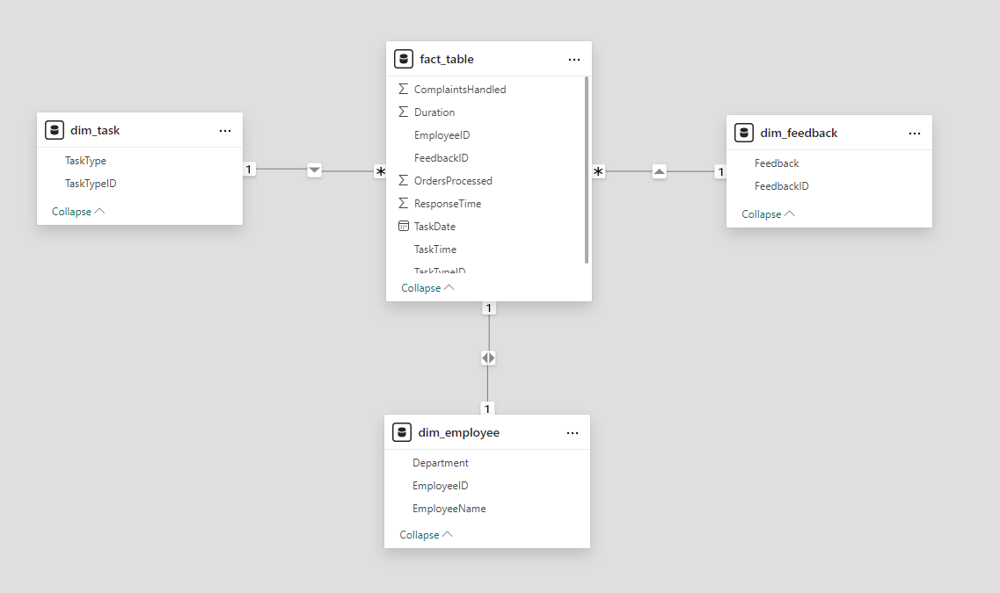

# GIOVANNA_VALES_DDF_TECH_072024
Case Técnico - Analista de Dados - Dadosfera

A Dadosfera, uma das maiores e mais renomadas consultorias de Data, AI & Analytics do Brasil, tem como objetivo transformar a forma como as empresas lidam com seus dados, promovendo eficiência operacional e tomada de decisões estratégicas baseadas em dados. Como parte do processo de seleção para novos profissionais de dados, a Dadosfera propôs um case técnico para avaliar a proficiência em diversos requisitos fundamentais.

## Sobre o Projeto

### Título do Projeto:

Case Técnico: Análise de Desempenho de Funcionários de E-commerce

### Versão:

1.0

### Data de Início:

26 de julho de 2024

### Gerente do Projeto:

Giovanna Vales

### Patrocinador:

Case Técnico Dadosfera

### Descrição do Projeto:

O cliente, uma grande empresa fictícia de e-commerce, busca construir uma plataforma de dados robusta para entregar análises descritivas e prescritivas de forma ágil e com menor custo. O foco deste case está na análise de desempenho dos funcionários, especificamente daqueles envolvidos em tarefas essenciais para o funcionamento do e-commerce, como atendimento ao cliente, processamento de pedidos e gerenciamento de estoque.

## Item 0 - Sobre Agilidade e Planejamento

[Iniciação do Projeto](https://github.com/giovales/GIOVANNA_VALES_DDF_TECH_072024/blob/main/Iniciacao_Projeto.md)
[Cronograma KanBan](https://github.com/users/giovales/projects/2)

## Item 1 - Sobre a Base de Dados

Para realizar este case técnico, foi criada uma base de dados sintética que simula o desempenho dos funcionários de um e-commerce. Esta base de dados inclui as seguintes variáveis:

- **EmployeeID**: Identificação única do funcionário.
- **TaskDate**: Data da realização da tarefa.
- **TaskTime**: Hora da realização da tarefa.
- **TaskType**: Tipo de tarefa realizada (atendimento ao cliente, processamento de pedidos, gerenciamento de estoque).
- **Duration**: Duração da tarefa em minutos.
- **OrdersProcessed**: Número de pedidos processados.
- **ComplaintsHandled**: Número de reclamações atendidas.
- **Feedback**: Feedback do cliente (positivo, negativo, neutro).
- **ResponseTime**: Tempo de resposta a solicitações em minutos.

## Item 02 - Sobre a Dadosfera Integrar

## Item 03 - Sobre a Dadosfera - Explorar

[Dicionário de Dados](https://github.com/giovales/GIOVANNA_VALES_DDF_TECH_072024/blob/main/Dicionario_Dados.md)
[DataLake](https://github.com/giovales/GIOVANNA_VALES_DDF_TECH_072024/blob/main/Datalake.md)

## Item 04 - Sobre Data Quality

Para configurar o Great Expectations com um arquivo local, é necessário seguir alguns passos:

1. Especificar o arquivo a ser lido dentro do Data Asset
2. Criar um Data Source
3. Usar o Data Asset para criar um Batch Request
4. Criar o Validator
5. Usar o Validator para rodar as Expectations
6. Salvar as Expectations para serem usadas futuramente (opcional)
7. Criar Checkpoints (opcional)

O código utilizado para testar a qualidade e gerar o relatório de qualidade dos dados está disponível no arquivo [data_quality](https://github.com/giovales/GIOVANNA_VALES_DDF_TECH_072024/blob/main/data_quality/gx/data_quallity.ipynb).

[Resposta da questão sobre dados de qualidade](https://github.com/giovales/GIOVANNA_VALES_DDF_TECH_072024/blob/main/data_quality/resposta_questao.md).
[Relatório de qualidade](file:///D:/Nuvem/OneDrive%20-%20Indra/%C3%81rea%20de%20Trabalho/GIOVANNA_VALES_DDF_TECH_072024/data_quality/gx/uncommitted/data_docs/local_site/index.html).

## Item 05 - Sobre o uso de GenAI e LLMs - Processar

## Item 06 - Sobre Modelagem de Dados

### Modelo Dimensional de Kimball

Tem como objetivo simplificar as consultas e análises.

### Tabelas Dimensão

São as tabelas que contém atributos descritivos. Nesse caso, temos tabelas dimensão para Funcionários, Tipos de Tarefa e Feedback.

- Dimensão Funcionários - Tabela dim_employee.csv
- Dimensão Tipos de Tarefa - Tabela dim_task.csv
- Dimensão Feedback - Tabela dim_feedback.csv

### Tabela Fato

Contém as métricas (fatos) e chaves estrangeiras para as dimensões. 

- Tabela de Fatos Funcionários - fact_table.csv

Explicação da modelagem com duas versões finais pode ser vista [aqui](https://github.com/giovales/GIOVANNA_VALES_DDF_TECH_072024/blob/main/visoes_finais.md).

## Item 07 - sobre análise de Dados - Analisar

- Coleção de dados [Giovanna Vales - 072024](https://metabase-treinamentos.dadosfera.ai/collection/617-giovanna-vales-072024) criada.
- Dashboard [Análise de Desempenho de Funcionários de E-Commerce](https://metabase-treinamentos.dadosfera.ai/dashboard/147-analise-de-desempenho-de-funcionarios-de-e-commerce?tab=5-geral&processo=) criado.
- Relatório com as [queries usadas e prints](https://github.com/giovales/GIOVANNA_VALES_DDF_TECH_072024/blob/main/queries_prints.md) dos resultados criado. 
- [Questões](https://metabase-treinamentos.dadosfera.ai/collection/622-dashboard) criadas.

## Item 08 - Sobre Pipelines

## Item 09 - Sobre Data Apps
