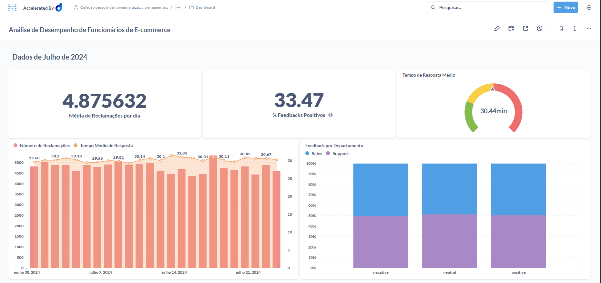

# Queries e Prints



### Média de Reclamações por dia

```sql
SELECT
  "PUBLIC"."TB__A861K7__FACT_TABLE"."TASKDATE" AS "TASKDATE",
  AVG(
    "PUBLIC"."TB__A861K7__FACT_TABLE"."COMPLAINTSHANDLED"
  ) AS "avg"
FROM
  "DADOSFERA_PRD_TREINAMENTOS"."PUBLIC"."TB__A861K7__FACT_TABLE"
WHERE
  LOWER("PUBLIC"."TB__A861K7__FACT_TABLE"."TASKDATE") LIKE '2024-07%'
GROUP BY
  "PUBLIC"."TB__A861K7__FACT_TABLE"."TASKDATE"
ORDER BY
  "PUBLIC"."TB__A861K7__FACT_TABLE"."TASKDATE" ASC
```

### % Feedbacks Positivos

```sql
SELECT
  (
    CAST(
      SUM(
        CASE
          WHEN "Tb 1k47ct Dim Feedback - Feedbackid"."FEEDBACK" = 'positive' THEN 1
          ELSE 0.0
        END
      ) AS float
    ) / CASE
      WHEN COUNT(*) = 0 THEN NULL
      ELSE COUNT(*)
    END
  ) * 100 AS "Feedbacks Positivos"
FROM
  "DADOSFERA_PRD_TREINAMENTOS"."PUBLIC"."TB__A861K7__FACT_TABLE"
 
LEFT JOIN "DADOSFERA_PRD_TREINAMENTOS"."PUBLIC"."TB__DQ9OG1__DIM_EMPLOYEE" AS "Tb Dq9og1 Dim Employee - Employeeid" ON "PUBLIC"."TB__A861K7__FACT_TABLE"."EMPLOYEEID" = "Tb Dq9og1 Dim Employee - Employeeid"."EMPLOYEEID"
  LEFT JOIN "DADOSFERA_PRD_TREINAMENTOS"."PUBLIC"."TB__1K47CT__DIM_FEEDBACK" AS "Tb 1k47ct Dim Feedback - Feedbackid" ON "PUBLIC"."TB__A861K7__FACT_TABLE"."FEEDBACKID" = "Tb 1k47ct Dim Feedback - Feedbackid"."FEEDBACKID"
WHERE
  LOWER("PUBLIC"."TB__A861K7__FACT_TABLE"."TASKDATE") LIKE '2024-07%'
  ```

  ### Tempo Médio de Resposta

 ```sql
  SELECT
  AVG("PUBLIC"."TB__A861K7__FACT_TABLE"."RESPONSETIME") AS "avg"
FROM
  "DADOSFERA_PRD_TREINAMENTOS"."PUBLIC"."TB__A861K7__FACT_TABLE"
 
LEFT JOIN "DADOSFERA_PRD_TREINAMENTOS"."PUBLIC"."TB__DQ9OG1__DIM_EMPLOYEE" AS "Tb Dq9og1 Dim Employee - Employeeid" ON "PUBLIC"."TB__A861K7__FACT_TABLE"."EMPLOYEEID" = "Tb Dq9og1 Dim Employee - Employeeid"."EMPLOYEEID"
WHERE
  (
    "Tb Dq9og1 Dim Employee - Employeeid"."DEPARTMENT" = 'Sales'
  )
 
   AND (
    LOWER("PUBLIC"."TB__A861K7__FACT_TABLE"."TASKDATE") LIKE '2024-07%'
  )
```

### Número de Reclamações vs Tempo Médio de Resposta

``` sql
SELECT
  "PUBLIC"."TB__A861K7__FACT_TABLE"."TASKDATE" AS "TASKDATE",
  SUM(
    "PUBLIC"."TB__A861K7__FACT_TABLE"."COMPLAINTSHANDLED"
  ) AS "sum",
  AVG("PUBLIC"."TB__A861K7__FACT_TABLE"."RESPONSETIME") AS "avg"
FROM
  "DADOSFERA_PRD_TREINAMENTOS"."PUBLIC"."TB__A861K7__FACT_TABLE"
WHERE
  LOWER("PUBLIC"."TB__A861K7__FACT_TABLE"."TASKDATE") LIKE '2024-07%'
GROUP BY
  "PUBLIC"."TB__A861K7__FACT_TABLE"."TASKDATE"
ORDER BY
  "PUBLIC"."TB__A861K7__FACT_TABLE"."TASKDATE" ASC
```

### Feedback por Departamento

``` sql
SELECT
  "Tb 1k47ct Dim Feedback - Feedbackid"."FEEDBACK" AS "Tb 1k47ct Dim Feedback - Feedbackid__FEEDBACK",
  "Tb Dq9og1 Dim Employee - Employeeid"."DEPARTMENT" AS "Tb Dq9og1 Dim Employee - Employeeid__DEPARTMENT",
  COUNT(*) AS "count"
FROM
  "DADOSFERA_PRD_TREINAMENTOS"."PUBLIC"."TB__A861K7__FACT_TABLE"
 
LEFT JOIN "DADOSFERA_PRD_TREINAMENTOS"."PUBLIC"."TB__DQ9OG1__DIM_EMPLOYEE" AS "Tb Dq9og1 Dim Employee - Employeeid" ON "PUBLIC"."TB__A861K7__FACT_TABLE"."EMPLOYEEID" = "Tb Dq9og1 Dim Employee - Employeeid"."EMPLOYEEID"
  LEFT JOIN "DADOSFERA_PRD_TREINAMENTOS"."PUBLIC"."TB__1K47CT__DIM_FEEDBACK" AS "Tb 1k47ct Dim Feedback - Feedbackid" ON "PUBLIC"."TB__A861K7__FACT_TABLE"."FEEDBACKID" = "Tb 1k47ct Dim Feedback - Feedbackid"."FEEDBACKID"
WHERE
  LOWER("PUBLIC"."TB__A861K7__FACT_TABLE"."TASKDATE") LIKE '2024-07%'
GROUP BY
  "Tb 1k47ct Dim Feedback - Feedbackid"."FEEDBACK",
  "Tb Dq9og1 Dim Employee - Employeeid"."DEPARTMENT"
ORDER BY
  "Tb 1k47ct Dim Feedback - Feedbackid"."FEEDBACK" ASC,
  "Tb Dq9og1 Dim Employee - Employeeid"."DEPARTMENT" ASC
```