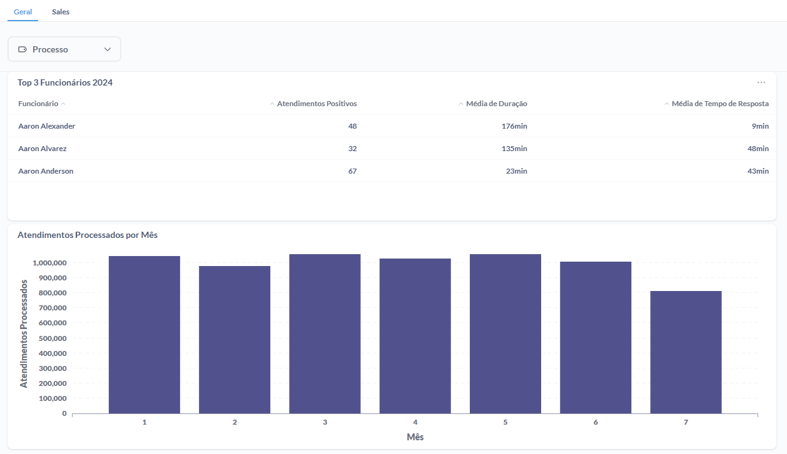
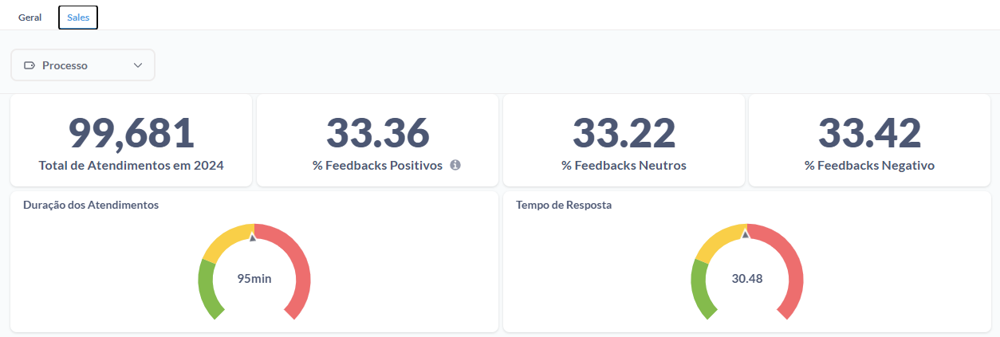

# Queries e Prints




### Atendimentos processados por mês

```sql
SELECT
  "source"."TaskMonth" AS "TaskMonth",
  SUM("source"."ORDERSPROCESSED") AS "sum"
FROM
  (
    SELECT
      "source"."TASKDATE" AS "TASKDATE",
      "source"."ORDERSPROCESSED" AS "ORDERSPROCESSED",
      DATE_PART("month", CAST("source"."TASKDATE" AS timestamp)) AS "TaskMonth"
    FROM
      (
        SELECT
          "PUBLIC"."TB__O7ZREH__SYNTHETIC_ECOMMERCE_EMPLOYEE_PERFORMANCE_DATA"."EMPLOYEEID" AS "EMPLOYEEID",
          "PUBLIC"."TB__O7ZREH__SYNTHETIC_ECOMMERCE_EMPLOYEE_PERFORMANCE_DATA"."TASKDATE" AS "TASKDATE",
          "PUBLIC"."TB__O7ZREH__SYNTHETIC_ECOMMERCE_EMPLOYEE_PERFORMANCE_DATA"."TASKTIME" AS "TASKTIME",
          "PUBLIC"."TB__O7ZREH__SYNTHETIC_ECOMMERCE_EMPLOYEE_PERFORMANCE_DATA"."TASKTYPE" AS "TASKTYPE",
          "PUBLIC"."TB__O7ZREH__SYNTHETIC_ECOMMERCE_EMPLOYEE_PERFORMANCE_DATA"."DURATION" AS "DURATION",
          "PUBLIC"."TB__O7ZREH__SYNTHETIC_ECOMMERCE_EMPLOYEE_PERFORMANCE_DATA"."ORDERSPROCESSED" AS "ORDERSPROCESSED",
          "PUBLIC"."TB__O7ZREH__SYNTHETIC_ECOMMERCE_EMPLOYEE_PERFORMANCE_DATA"."COMPLAINTSHANDLED" AS "COMPLAINTSHANDLED",
          "PUBLIC"."TB__O7ZREH__SYNTHETIC_ECOMMERCE_EMPLOYEE_PERFORMANCE_DATA"."FEEDBACK" AS "FEEDBACK",
          "PUBLIC"."TB__O7ZREH__SYNTHETIC_ECOMMERCE_EMPLOYEE_PERFORMANCE_DATA"."RESPONSETIME" AS "RESPONSETIME",
          "PUBLIC"."TB__O7ZREH__SYNTHETIC_ECOMMERCE_EMPLOYEE_PERFORMANCE_DATA"."_PROCESSING_TIMESTAMP" AS "_PROCESSING_TIMESTAMP"
        FROM
          "DADOSFERA_PRD_TREINAMENTOS"."PUBLIC"."TB__O7ZREH__SYNTHETIC_ECOMMERCE_EMPLOYEE_PERFORMANCE_DATA"
      ) AS "source"
  ) AS "source"
GROUP BY
  "source"."TaskMonth"
ORDER BY
  "source"."TaskMonth" ASC
```

### Top 3 Funcionários

```sql
SELECT
  "Tb Dq9og1 Dim Employee - Employeeid"."EMPLOYEENAME" AS "Tb Dq9og1 Dim Employee - Employeeid__EMPLOYEENAME",
  SUM("source"."ORDERSPROCESSED") AS "sum",
  AVG("source"."DURATION") AS "avg",
  AVG("source"."RESPONSETIME") AS "avg_2"
FROM
  (
    SELECT
      "PUBLIC"."TB__O7ZREH__SYNTHETIC_ECOMMERCE_EMPLOYEE_PERFORMANCE_DATA"."EMPLOYEEID" AS "EMPLOYEEID",
      "PUBLIC"."TB__O7ZREH__SYNTHETIC_ECOMMERCE_EMPLOYEE_PERFORMANCE_DATA"."TASKDATE" AS "TASKDATE",
      "PUBLIC"."TB__O7ZREH__SYNTHETIC_ECOMMERCE_EMPLOYEE_PERFORMANCE_DATA"."TASKTIME" AS "TASKTIME",
      "PUBLIC"."TB__O7ZREH__SYNTHETIC_ECOMMERCE_EMPLOYEE_PERFORMANCE_DATA"."TASKTYPE" AS "TASKTYPE",
      "PUBLIC"."TB__O7ZREH__SYNTHETIC_ECOMMERCE_EMPLOYEE_PERFORMANCE_DATA"."DURATION" AS "DURATION",
      "PUBLIC"."TB__O7ZREH__SYNTHETIC_ECOMMERCE_EMPLOYEE_PERFORMANCE_DATA"."ORDERSPROCESSED" AS "ORDERSPROCESSED",
      "PUBLIC"."TB__O7ZREH__SYNTHETIC_ECOMMERCE_EMPLOYEE_PERFORMANCE_DATA"."COMPLAINTSHANDLED" AS "COMPLAINTSHANDLED",
      "PUBLIC"."TB__O7ZREH__SYNTHETIC_ECOMMERCE_EMPLOYEE_PERFORMANCE_DATA"."FEEDBACK" AS "FEEDBACK",
      "PUBLIC"."TB__O7ZREH__SYNTHETIC_ECOMMERCE_EMPLOYEE_PERFORMANCE_DATA"."RESPONSETIME" AS "RESPONSETIME",
      "PUBLIC"."TB__O7ZREH__SYNTHETIC_ECOMMERCE_EMPLOYEE_PERFORMANCE_DATA"."_PROCESSING_TIMESTAMP" AS "_PROCESSING_TIMESTAMP"
    FROM
      "DADOSFERA_PRD_TREINAMENTOS"."PUBLIC"."TB__O7ZREH__SYNTHETIC_ECOMMERCE_EMPLOYEE_PERFORMANCE_DATA"
  ) AS "source"
 
LEFT JOIN "DADOSFERA_PRD_TREINAMENTOS"."PUBLIC"."TB__DQ9OG1__DIM_EMPLOYEE" AS "Tb Dq9og1 Dim Employee - Employeeid" ON "source"."EMPLOYEEID" = "Tb Dq9og1 Dim Employee - Employeeid"."EMPLOYEEID"
  LEFT JOIN "DADOSFERA_PRD_TREINAMENTOS"."PUBLIC"."TB__1K47CT__DIM_FEEDBACK" AS "Tb 1k47ct Dim Feedback - Feedback" ON "source"."FEEDBACK" = "Tb 1k47ct Dim Feedback - Feedback"."FEEDBACK"
WHERE
  "Tb 1k47ct Dim Feedback - Feedback"."FEEDBACK" = 'positive'
GROUP BY
  "Tb Dq9og1 Dim Employee - Employeeid"."EMPLOYEENAME"
ORDER BY
  "Tb Dq9og1 Dim Employee - Employeeid"."EMPLOYEENAME" ASC
LIMIT
  3
```

### Total de Atendimentos em 2024

```sql
SELECT
  COUNT(*) AS "count"
FROM
  "DADOSFERA_PRD_TREINAMENTOS"."PUBLIC"."TB__A861K7__FACT_TABLE"
 
LEFT JOIN "DADOSFERA_PRD_TREINAMENTOS"."PUBLIC"."TB__DQ9OG1__DIM_EMPLOYEE" AS "Tb Dq9og1 Dim Employee - Employeeid" ON "PUBLIC"."TB__A861K7__FACT_TABLE"."EMPLOYEEID" = "Tb Dq9og1 Dim Employee - Employeeid"."EMPLOYEEID"
  LEFT JOIN "DADOSFERA_PRD_TREINAMENTOS"."PUBLIC"."TB__1K47CT__DIM_FEEDBACK" AS "Tb 1k47ct Dim Feedback - Feedbackid" ON "PUBLIC"."TB__A861K7__FACT_TABLE"."FEEDBACKID" = "Tb 1k47ct Dim Feedback - Feedbackid"."FEEDBACKID"
WHERE
  "Tb Dq9og1 Dim Employee - Employeeid"."DEPARTMENT" = 'Sales'
```

### % Feedback Positivo

```sql
SELECT
  (
    CAST(
      SUM(
        CASE
          WHEN "Tb 1k47ct Dim Feedback - Feedbackid"."FEEDBACK" = 'positive' THEN 1
          ELSE 0.0
        END
      ) AS float
    ) / CASE
      WHEN COUNT(*) = 0 THEN NULL
      ELSE COUNT(*)
    END
  ) * 100 AS "Feedbacks Positivos"
FROM
  "DADOSFERA_PRD_TREINAMENTOS"."PUBLIC"."TB__A861K7__FACT_TABLE"
 
LEFT JOIN "DADOSFERA_PRD_TREINAMENTOS"."PUBLIC"."TB__DQ9OG1__DIM_EMPLOYEE" AS "Tb Dq9og1 Dim Employee - Employeeid" ON "PUBLIC"."TB__A861K7__FACT_TABLE"."EMPLOYEEID" = "Tb Dq9og1 Dim Employee - Employeeid"."EMPLOYEEID"
  LEFT JOIN "DADOSFERA_PRD_TREINAMENTOS"."PUBLIC"."TB__1K47CT__DIM_FEEDBACK" AS "Tb 1k47ct Dim Feedback - Feedbackid" ON "PUBLIC"."TB__A861K7__FACT_TABLE"."FEEDBACKID" = "Tb 1k47ct Dim Feedback - Feedbackid"."FEEDBACKID"
WHERE
  "Tb Dq9og1 Dim Employee - Employeeid"."DEPARTMENT" = 'Sales'
```

OBS.: Para negativo, alterar ‘negative’ e neutro para ‘neutral’

### Duração dos Atendimentos

```sql
SELECT
  AVG("PUBLIC"."TB__A861K7__FACT_TABLE"."DURATION") AS "avg"
FROM
  "DADOSFERA_PRD_TREINAMENTOS"."PUBLIC"."TB__A861K7__FACT_TABLE"
 
LEFT JOIN "DADOSFERA_PRD_TREINAMENTOS"."PUBLIC"."TB__DQ9OG1__DIM_EMPLOYEE" AS "Tb Dq9og1 Dim Employee - Employeeid" ON "PUBLIC"."TB__A861K7__FACT_TABLE"."EMPLOYEEID" = "Tb Dq9og1 Dim Employee - Employeeid"."EMPLOYEEID"
WHERE
  "Tb Dq9og1 Dim Employee - Employeeid"."DEPARTMENT" = 'Sales'
```

### Tempo de Resposta

```sql
SELECT
  AVG("PUBLIC"."TB__A861K7__FACT_TABLE"."RESPONSETIME") AS "avg"
FROM
  "DADOSFERA_PRD_TREINAMENTOS"."PUBLIC"."TB__A861K7__FACT_TABLE"
 
LEFT JOIN "DADOSFERA_PRD_TREINAMENTOS"."PUBLIC"."TB__DQ9OG1__DIM_EMPLOYEE" AS "Tb Dq9og1 Dim Employee - Employeeid" ON "PUBLIC"."TB__A861K7__FACT_TABLE"."EMPLOYEEID" = "Tb Dq9og1 Dim Employee - Employeeid"."EMPLOYEEID"
WHERE
  "Tb Dq9og1 Dim Employee - Employeeid"."DEPARTMENT" = 'Sales'
```